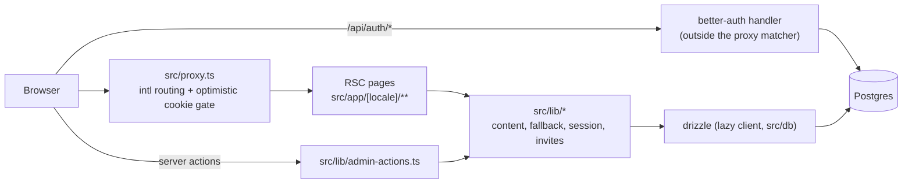

# 硅基生态平台 / Silicon Ecosystem — Architecture

Single Next.js App Router application, DB-backed content, deployed to Vercel
and as a self-hosted Docker container from the same codebase. Domain terms
used here are defined in [CONTEXT.md](../CONTEXT.md); decisions have records
in [docs/adr/](./adr/).

## System overview

- Every page lives under `/[locale]` (`en`, `zh`; always prefixed).
- The proxy composes next-intl's middleware with a gate: if the bare path is
  gated (`src/lib/gating.ts`) and no session cookie exists, redirect to the
  locale's sign-in with a `next=` param. Its matcher excludes `/api` so intl
  rewrites can never break better-auth routes.

## Request & auth flow

- **Optimistic vs authoritative**: the proxy only checks cookie *existence*
  (no DB hit, spoofable-by-presence — acceptable because every gated page and
  server action re-verifies via `requireSession()` / `requireAdmin()` in
  `src/lib/session.ts`). `requireAdmin` calls `notFound()` for non-admins:
  the admin area is concealed, not just denied.
- **Sign-up is invite-only**, enforced in the better-auth request hooks
  (`src/lib/auth.ts`), so posting directly to `/api/auth/sign-up/email`
  cannot bypass it. Exception: when the user table is empty, the first
  signup is allowed and becomes admin (bootstrap).
- **Auth state changes use full-document navigation** via
  `src/lib/hard-navigate.ts`: the layout's session-dependent chrome (user
  menu, admin link) must re-render with fresh cookies; client-side
  `router.push` would keep it stale.

## Content model & locale fallback

- One `resources` table (type enum, slug unique per type, draft/published,
  `tags text[]`, `meta` jsonb) + `resource_translations` per locale. Courses
  add `course_chapters` (+ translations) with dense 1..n positions.
- `meta` is validated at write time against the per-type zod schema in
  `src/lib/resource-meta.ts` — the database stays schema-light, the
  application stays typed.
- The fallback policy is pure code in `src/lib/fallback.ts`; queries in
  `src/lib/content.ts` fetch both locales' rows and pick. Untranslated-
  everywhere resources never surface publicly (admin list still shows them);
  publishing requires ≥1 translation (enforced in `saveSettings`).

## i18n

- next-intl v4, `localePrefix: 'always'` — every URL carries its locale, so
  redirects and shared links are unambiguous.
- UI strings live in `messages/en.json` / `zh.json`; `bun run i18n:check`
  fails on key drift (also asserted by a unit test).

## Admin & server-action conventions

- **Route groups and layouts are not security boundaries.** Every admin page
  AND every server action starts with `requireAdmin()`; gated pages call
  `requireSession()`. Moving files never changes the security posture.
- Mutations are server actions in `src/lib/admin-actions.ts`: zod-parse
  input, return `ActionState` (`{ ok?, error? }`) for `useActionState`
  forms, `revalidatePath('/', 'layout')` after writes.
- Chapter reordering does two-phase position swaps (unique constraint), and
  deletion renumbers to keep positions dense — chapter URLs are positional.

## Deployment targets & constraints

Two targets, one codebase — the constraints that keep both working:

- **No Vercel-only service dependencies** (no Blob/KV/Edge Config/cron).
- **Runtime-read env only**: `DATABASE_URL`, `BETTER_AUTH_SECRET`,
  `BETTER_AUTH_URL`, optional `DATABASE_POOLED`. No `NEXT_PUBLIC_*` for
  anything environment-dependent (those bake in at build).
- **Plain TCP Postgres** (postgres.js) — works for Neon and docker-compose
  Postgres alike. The client is a lazy proxy (`src/db/index.ts`) so `next
  build` never needs a database; all DB-backed pages are `force-dynamic`.
- **Docker**: multi-stage Dockerfile, Bun builds, `node:22-bookworm-slim`
  runs (glibc must match for sharp — never alpine). Next's standalone output
  bundles server deps into chunks, so migrations run from a self-contained
  bundle (`bun build scripts/migrate.mjs`) in the entrypoint, before the
  server starts. Vercel runs the same script from node_modules
  (`build:vercel`).
- **Standalone output is opt-in** (`BUILD_STANDALONE=1`, set only in the
  Dockerfile build stage) and must stay off on Vercel. Vercel's build adapter
  owns file tracing and never writes `.next/next-server.js.nft.json`, which
  Next's standalone step reads without a guard — enabling it there fails the
  build after page generation. The flag is target-shaped rather than
  host-shaped so no host is named in `next.config.ts`.
- **Only production deployments migrate.** `scripts/migrate.mjs` exits early
  when `VERCEL_ENV` is set to anything but `production`, because preview
  deployments point at the database production uses. Local runs, CI, and the
  Docker entrypoint never set `VERCEL_ENV` and are unaffected.
- CI's docker job boots the compose stack and curls it on every PR.

## Theming & chrome

Tailwind v4, CSS-first — there is no `tailwind.config.*`. `src/app/globals.css`
holds the whole token set. **Semantic UI colour** — surfaces, text, borders,
states — comes from tokens via utilities (`bg-background`,
`text-muted-foreground`, `border-border`); components should not hard-code it,
so a scope swap like `.landing` below reaches everything.

Decorative colour is the exception and is allowed inline: the landing's
ambient glows (`src/components/landing/primitives.tsx`), preview-card tints,
and status dots are one-off ramps carried straight from the design, not tokens
anything else should reuse.

- **Two canvases.** The app is light; the landing page (`/`) is dark. A
  `.landing` class re-points the standard tokens at the landing palette and is
  applied together with `.dark` so the shadcn primitives' `dark:` variants
  stay correct. `src/components/site/chrome-shell.tsx` reads the
  locale-stripped pathname and opens that scope around the header, page and
  footer. **`SiteHeader`, `SiteFooter` and any shared chrome therefore render
  on both canvases — check both when changing them.**
- **Font families are indirected** through `--font-*-stack` properties in
  `:root`, because `@theme inline` pastes its value straight into each utility
  and so must name a property that exists at runtime. That indirection is also
  what lets a scope swap a family list.
- **`--brand*` are constants**, not theme state. The app chrome is
  deliberately achromatic; the accent belongs to the landing and the brand
  mark.
- Landing copy is held to shipped capability, enforced by an e2e test. See
  [ADR 0008](./adr/0008-landing-visual-system.md).

## Testing & QA gates

| Layer | Tool | Owns |
|---|---|---|
| Unit (`src/**/*.test.ts`, `scripts/`) | bun test | fallback policy, meta/slug validation, gated-path classification, message-key diffing |
| DB integration (`tests/db/`) | bun test + `porta_test` | invite lifecycle, content visibility queries, the signup-hook contract via direct `auth.api` calls |
| E2E (`e2e/*.e2e.ts`) | Playwright + `porta_e2e` | proxy gating, invite→signup lifecycle, editorial publish flow, i18n badges, smoke |

`bun run verify` = format check + lint (zero warnings) + typecheck + i18n
parity + unit/DB tests — the local landing gate. Naming rule: bun test picks
up `*.test.ts`; Playwright owns `*.e2e.ts`.

Test-database safety: the bun-test preload force-assigns `DATABASE_URL` to a
`_test`-suffixed database (bun auto-loads `.env`, so defaulting would aim
TRUNCATEs at the dev database), and the e2e prep script requires an `_e2e`
suffix before dropping anything.

## Adding a section

A new section is additive — no schema surgery:

1. Add the value to the `resource_type` enum in `src/db/schema/content.ts`;
   `bun run db:generate` a migration.
2. Add a meta zod schema + `sectionForType` entry in
   `src/lib/resource-meta.ts` (admin settings form fields render from it).
3. Add listing and detail pages under `src/app/[locale]/<section>/`
   (copy the closest existing section).
4. Add the section to the nav (`src/components/site/header.tsx`), the gating
   patterns (`src/lib/gating.ts`) if details are gated, and both message
   files.
