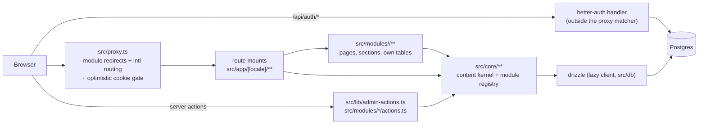

# 硅基生态平台 / Silicon Ecosystem — Architecture

Single Next.js App Router application, DB-backed content, deployed to Vercel
and as a self-hosted Docker container from the same codebase. It is organised
as **feature modules over a shared kernel**: `src/core` is the platform,
`src/modules/<id>` is one team's vertical slice, and `src/lib` is platform
internals no module may call ([ADR 0013](./adr/0013-feature-modules-and-the-module-registry.md)).
Domain terms used here are defined in [CONTEXT.md](../CONTEXT.md); decisions
have records in [docs/adr/](./adr/).

## System overview

- Every page lives under `/[locale]` (`en`, `zh`; always prefixed).
- Route files under `src/app` are **two-line mounts**: they re-export the page
  from the module that owns it and declare `dynamic = 'force-dynamic'` (route
  segment config is read from the route file, so it cannot be re-exported).
- The proxy does three things in order: apply the path moves modules declare
  (`redirects` in a manifest), gate (if the bare path is gated and no session
  cookie exists, redirect to the locale's sign-in with a `next=` param), then
  hand off to next-intl's middleware. Redirect-before-gate matters: otherwise
  a signed-out visitor's `next=` would point at a path that no longer exists.
  The matcher excludes `/api` so intl rewrites can never break better-auth
  routes.

## Request & auth flow

- **Optimistic vs authoritative**: the proxy only checks cookie *existence*
  (no DB hit, spoofable-by-presence — acceptable because every gated page and
  server action re-verifies via `requireSession()` / `requireAdmin()` in
  `src/lib/session.ts`). `requireAdmin` calls `notFound()` for non-admins:
  the admin area is concealed, not just denied. A banned user's session
  reads as absent in `getSession` — a ban must not wait for the session to
  expire.
- **Sign-up is invite-only**, enforced in the better-auth hooks
  (`src/lib/auth.ts`), so posting directly to `/api/auth/sign-up/email`
  cannot bypass it. The request hook produces the friendly errors; the
  single-use guarantee is an atomic conditional claim (`claimInvite`) during
  user creation, so concurrent signups holding one token cannot both land.
  Exception: when the user table is empty, the first signup is allowed and
  becomes admin (bootstrap); a bootstrap signup that finds another user
  after creation rolls itself back rather than minting a second admin.
- **Auth state changes use full-document navigation** via
  `src/lib/hard-navigate.ts`: the layout's session-dependent chrome (user
  menu, admin link) must re-render with fresh cookies; client-side
  `router.push` would keep it stale.

## Modules and the registry

- A module is a directory: `module.ts` (a **pure-data manifest** — no JSX, no
  DB, no server-only imports, because the middleware reaches it),
  `messages/{en,zh}.json`, `pages/`, optionally `schema.ts` for tables of its
  own, plus components and colocated tests.
- `src/core/module/registry.ts` lists the modules. `derive.ts` computes
  navigation, gated-path regexes, section lookups, message merging and
  redirects from it — there is no second list anywhere.
- `src/core/module/registry.test.ts` is the contract: duplicate section keys
  or paths, a module id shadowing a core namespace, a gated listing, or a
  manifest naming a message key it does not ship all fail `bun run verify`.
- **Boundaries are enforced, not documented.** Only the registry and
  `src/app/**` may name a module; a module may not import another module or a
  platform internal (`auth`, `invites`, `email`, `admin-actions`). `@/db` is
  open to modules on purpose — owning tables is a supported seam.
  - `no-restricted-imports` (`eslint.config.mjs`, `--max-warnings 0`) catches
    the alias form in the editor.
  - `src/core/module/boundaries.test.ts` catches it however it is written: it
    reads imports with TypeScript's parser and resolves them to repo-relative
    paths, so `../../other-module/thing` fails the same way
    `@/modules/other-module/thing` does. ESLint alone cannot see that, and
    relative imports are the house style inside a module.
  - It **fails closed** on everything it can be wrong about: a dynamic
    `import()` whose argument it cannot reduce to a path (a concatenation, a
    ternary, a variable, any interpolated template), a file under `src` whose
    extension is neither scanned nor known to be inert, module discovery
    drifting from the registry, and CommonJS loaders in any spelling
    (`require`, `module.require`, `require.resolve` — src is ESM, and
    `module.require(...)` reads nothing like an import). Enumerating the ways
    round a checker is a losing game; not knowing has to be a finding.

## Content model & locale fallback

- One `resources` table (`type` as **text**, validated against the registry at
  write time; slug unique per type; draft/published; `tags text[]`; `meta`
  jsonb) + `resource_translations` per locale. Modules may add tables of their
  own — Help & Tutorials owns `course_chapters` (+ translations) with dense
  1..n positions.
- `meta` is validated at write time against the section's zod schema, which
  lives in the owning module — the database stays schema-light, the
  application stays typed.
- The fallback policy is pure code in `src/core/content/fallback.ts`; queries
  in `src/core/content/queries.ts` fetch both locales' rows and pick.
  `pickTranslation` is the primitive a module reuses for its own translated
  rows. Untranslated-everywhere resources never surface publicly (admin list
  still shows them); publishing requires ≥1 translation (enforced in
  `saveSettings`).
- Public search (`listPublished`) is a SQL `ILIKE` across every translation's
  title/summary/body in both locales, backed by `pg_trgm` GIN indexes;
  listings paginate at the resource level (page size 24). See
  [ADR 0011](./adr/0011-search-and-pagination.md).

## i18n

- next-intl v4, `localePrefix: 'always'` — every URL carries its locale, so
  redirects and shared links are unambiguous.
- Core UI strings live in `messages/en.json` / `zh.json`; **each module ships
  its own** `src/modules/<id>/messages/{en,zh}.json`, merged at request time
  under the module id as its namespace. Splitting them is what stops three
  teams colliding on one file.
- `bun run i18n:check` diffs the core bundle and every module bundle
  independently and names the failing file (also asserted by a unit test), so
  a module can only break its own parity.

## Admin & server-action conventions

- **Route groups and layouts are not security boundaries.** Every admin page
  AND every server action starts with `requireAdmin()`; gated pages call
  `requireSession()`. Moving files never changes the security posture.
- Mutations are server actions: generic resource ones in
  `src/lib/admin-actions.ts`, module-specific ones in
  `src/modules/<id>/actions.ts`. All of them zod-parse input, return
  `ActionState` (`{ ok?, error? }`) for `useActionState` forms, and
  `revalidatePath('/', 'layout')` after writes. The shared contract —
  `ActionState`, `submittedValues`, the SQLSTATE unwrapping that turns races
  into handled errors — lives in `src/core/content/actions.ts` rather than in
  the action files, because a `'use server'` module may only export async
  functions and so cannot publish helpers.
- One admin editor serves every section: type-specific fields render from the
  `metaFields` descriptors the module registered, with labels resolved in that
  module's namespace, so adding a field needs no change in core.
- Chapter reordering does two-phase position swaps (unique constraint), and
  deletion renumbers to keep positions dense — chapter URLs are positional.
  Both live in `src/modules/help/actions.ts`.

## Deployment targets & constraints

Two targets, one codebase — the constraints that keep both working:

- **No Vercel-only service dependencies** (no Blob/KV/Edge Config/cron).
- **Runtime-read env only**: `DATABASE_URL`, `BETTER_AUTH_SECRET`,
  `BETTER_AUTH_URL`, optional `DATABASE_POOLED`. No `NEXT_PUBLIC_*` for
  anything environment-dependent (those bake in at build).
- **Plain TCP Postgres** (postgres.js) — works for Neon and docker-compose
  Postgres alike. The client is a lazy proxy (`src/db/index.ts`) so `next
  build` never needs a database; all DB-backed pages are `force-dynamic`.
- **Docker**: multi-stage Dockerfile, Bun builds, `node:24-bookworm-slim`
  runs (glibc must match for sharp — never alpine). Next's standalone output
  bundles server deps into chunks, so migrations run from a self-contained
  bundle (`bun build scripts/migrate.mjs`) in the entrypoint, before the
  server starts. Vercel runs the same script from node_modules
  (`build:vercel`).
- **Standalone output is opt-in** (`BUILD_STANDALONE=1`, set only in the
  Dockerfile build stage) and must stay off on Vercel. Vercel's build adapter
  owns file tracing and never writes `.next/next-server.js.nft.json`, which
  Next's standalone step reads without a guard — enabling it there fails the
  build after page generation. The flag is target-shaped rather than
  host-shaped so no host is named in `next.config.ts`.
- **Only production deployments migrate.** `scripts/migrate.mjs` exits early
  when `VERCEL_ENV` is set to anything but `production`, because preview
  deployments point at the database production uses. Local runs, CI, and the
  Docker entrypoint never set `VERCEL_ENV` and are unaffected.
- CI's docker job boots the compose stack and curls it on every PR.

## Theming & chrome

Tailwind v4, CSS-first — there is no `tailwind.config.*`. `src/app/globals.css`
holds the whole token set. **Semantic UI colour** — surfaces, text, borders,
states — comes from tokens via utilities (`bg-background`,
`text-muted-foreground`, `border-border`); components should not hard-code it,
so a scope swap like `.landing` below reaches everything.

Decorative colour is the exception and is allowed inline: the landing's
ambient glows (`src/components/landing/primitives.tsx`), preview-card tints,
and status dots are one-off ramps carried straight from the design, not tokens
anything else should reuse.

- **Two canvases.** The app is light; the landing page (`/`) is dark. A
  `.landing` class re-points the standard tokens at the landing palette and is
  applied together with `.dark` so the shadcn primitives' `dark:` variants
  stay correct. `src/components/site/chrome-shell.tsx` reads the
  locale-stripped pathname and opens that scope around the header, page and
  footer. **`SiteHeader`, `SiteFooter` and any shared chrome therefore render
  on both canvases — check both when changing them.**
- **Font families are indirected** through `--font-*-stack` properties in
  `:root`, because `@theme inline` pastes its value straight into each utility
  and so must name a property that exists at runtime. That indirection is also
  what lets a scope swap a family list.
- **`--brand*` are constants**, not theme state. The app chrome is
  deliberately achromatic; the accent belongs to the landing and the brand
  mark.
- Landing copy is held to shipped capability, enforced by an e2e test. See
  [ADR 0008](./adr/0008-landing-visual-system.md).

## Testing & QA gates

| Layer | Tool | Owns |
|---|---|---|
| Unit (`src/**/*.test.ts`, `scripts/`) | bun test | fallback policy, meta/slug validation, gated-path classification, message-key diffing, **the module registry contract** |
| DB integration (`tests/db/`) | bun test + `porta_test` | invite lifecycle, content visibility queries, chapter ordering, the signup-hook contract via direct `auth.api` calls |
| E2E (`e2e/*.e2e.ts`) | Playwright + `porta_e2e` | proxy gating, module redirects, invite→signup lifecycle, editorial publish flow, i18n badges, smoke |

A module's own tests are colocated with it (`src/modules/<id>/*.test.ts`) —
its meta schemas are its own to break.

`bun run verify` = format check + lint (zero warnings) + typecheck + i18n
parity + unit/DB tests — the local landing gate. Naming rule: bun test picks
up `*.test.ts`; Playwright owns `*.e2e.ts`.

Test-database safety: the bun-test preload force-assigns `DATABASE_URL` to a
`_test`-suffixed database (bun auto-loads `.env`, so defaulting would aim
TRUNCATEs at the dev database), and the e2e prep script requires an `_e2e`
suffix before dropping anything.

## Adding a section to a module

Entirely inside the module — no core file, no migration:

1. Add a section to `sections` in `src/modules/<id>/module.ts`: a `key`
   (globally unique, stored in `resources.type`), a `path`, title/description
   message keys, a zod `meta` schema, and `metaFields` descriptors.
2. Add those keys to **both** `src/modules/<id>/messages/*.json`.
3. Add a listing page — `createListingPage('<key>')` from
   `@/core/content/listing-page` is usually the whole file — and a detail page
   that renders your `meta`.
4. Mount them: `src/app/[locale]/<path>/page.tsx` re-exporting the page plus
   `export const dynamic = 'force-dynamic'`.

Nav, gating, the admin type filter and the admin form fields all follow from
the manifest. `bun run verify` fails if a key collides or a message is
missing.

## Adding a module

`bun run module:new <id>` scaffolds all of this and leaves the tree green;
what it generates is:

1. `src/modules/<id>/` with `module.ts`, `messages/{en,zh}.json`, `pages/`.
   The manifest needs `id` (also its i18n namespace), `nav`, `sections` and
   `messages`; add `redirects` if it is taking over existing paths.
2. Route mounts under `src/app/[locale]/`. A module with several sections
   usually wants `createModuleIndexPage('<id>')` at its base path.
3. **One line** in `src/core/module/registry.ts`.

Optional: `schema.ts` if the module needs tables of its own — drizzle-kit
picks it up via the glob in `drizzle.config.ts`. Note that migrations still
land in one `drizzle/` folder, so two modules generating migrations at the
same time conflict in `drizzle/meta/_journal.json`; the fix is to regenerate,
and it is the accepted price of a single-container deployment (ADR 0005).
